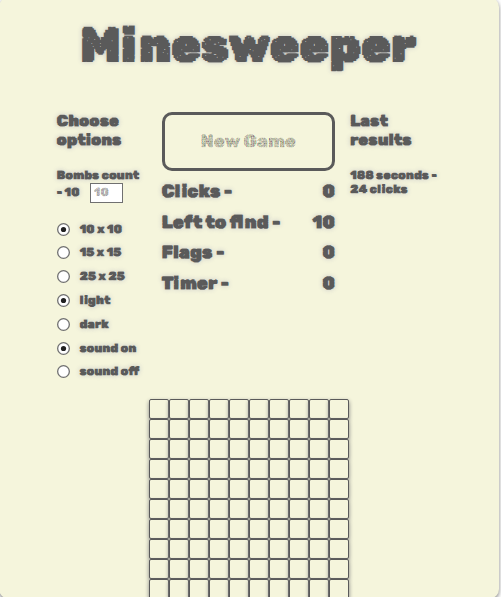

### Minesweeper Game ###

***************************

## About poject ##

A classic **Minesweeper** game built using HTML, CSS, and JavaScript. This version includes multiple difficulty levels, a responsive UI, sound effects, themes, and additional advanced features for an enhanced user experience.

***************************

## Deploy ##

* [https://minesweeper-dusky-six.vercel.app](https://minesweeper-dusky-six.vercel.app)

***************************

## Game Rules ## 

- **The game starts with a 10x10 grid filled with 10 mines by default.**
- **Click on cells to reveal either an empty cell, a number, or a mine.**
- **Numbers indicate how many mines are adjacent to the cell.**
- **You can flag cells to mark where you think a mine is located.**
- **Win by revealing all cells without mines. Lose by clicking on a mine.**
- **You can change the grid size and number of mines in the game settings.**

***************************

## Setting up ##

* Clone this repo: $ git clone https://github.com/massaracsh7/minesweeper.git

* Go to downloaded folder: $ cd minesweeper.

* Open the index.html file in your browser or use a local server to run the game..

***************************

## Stack

The project is built using the following technologies:

- **HTML**: Structure and layout of the game.
- **CSS**: Styling and responsive design of the game board and UI components.
- **JavaScript (ES6+)**: Core game logic, event handling, and DOM manipulation. Modules are used to organize the code.
- **LocalStorage**: Used to store the latest 10 game results and save the current game state.

***************************

## Features

- **Layout, design, and responsive UI**: A clean, user-friendly design that adapts to different screen sizes.
- **Default game state**: The game board is a 10x10 grid with 10 hidden mines.
- **Gameplay mechanics**: Users can click on cells to reveal either an empty cell, a number indicating the nearby mines, or a mine.
- **End game states**: Users win when all non-mined cells are revealed or lose by clicking on a mine. The game ends with a win or lose message.

- **Safe first move**: Mines are placed after the first move, ensuring that the user never loses on the first click.
- **Flagging mines**: Users can mark suspected mines with flags. The number of remaining mines and used flags is displayed.
- **Color-coded cells**: Numbers indicating the surrounding mines are color-coded for easier reading.
- **Restartable game**: The game can be restarted without needing to reload the page.
- **Game statistics**: The number of clicks and the game duration are displayed.
- **Auto-open empty cells**: If an empty cell is clicked, adjacent empty cells are automatically opened until cells with numbers are reached.

- **Sound effects**: Click sounds and end-of-game sounds can be toggled on or off.
- **Customizable game size and mine count**: Users can choose between three board sizes (10x10, 15x15, 25x25) and adjust the number of mines (from 10 to 99).
- **LocalStorage support**: The last 10 game results are saved in LocalStorage.
- **Game state saving**: The game state is saved so users can resume their progress.
- **Theme options**: Dark and light themes are available for the game board.